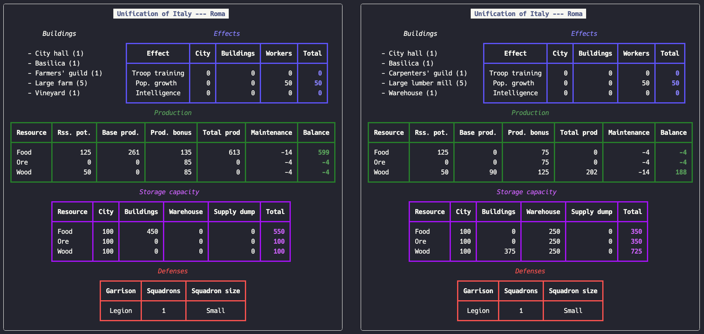
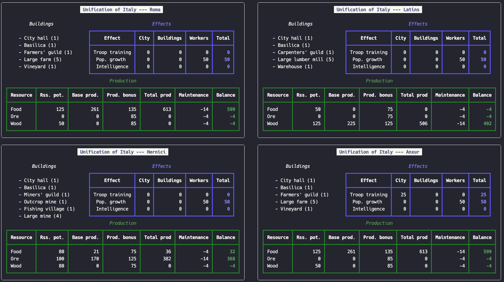

# Legion

This project is a script that allows to compare different production configurations for a given city in Legion, or
across different cities.

To create a comparison, add the city configurations in the `legion.py` script:

```python
from modules.scenario import Scenario


scenario: Scenario = Scenario.from_list(
    data = [
        {
            "campaign": "Unification of Italy",
            "name": "Roma",
            "buildings": {
                "city_hall": 1,
                "basilica": 1,
                "farmers_guild": 1,
                "large_farm": 5,
                "vineyard": 1,
            },
        },
        {
            "campaign": "Unification of Italy",
            "name": "Roma",
            "buildings": {
                "city_hall": 1,
                "basilica": 1,
                "carpenters_guild": 1,
                "large_lumber_mill": 5,
                "warehouse": 1,
            },
        },
    ],
    configuration = {
        "city": {
            "include": True,
        },
        "defenses": {
            "include": True,
        },
        "storage": {
            "include": True,
        },
    },
)

scenario.display_scenario_results()
```

The terminal output will display a comparison between the different scenarios



You can select which elements of the comparison to display based on your focus:

- `city` controls the printing of the campaign and city title
- `buildings` controls the printing of the list of buildings
- `effects` controls the printing of the effects table
- `production` controls the printing of the production table
- `storage` controls the printing of the storage table
- `defenses` controls the printing of the defenses table


