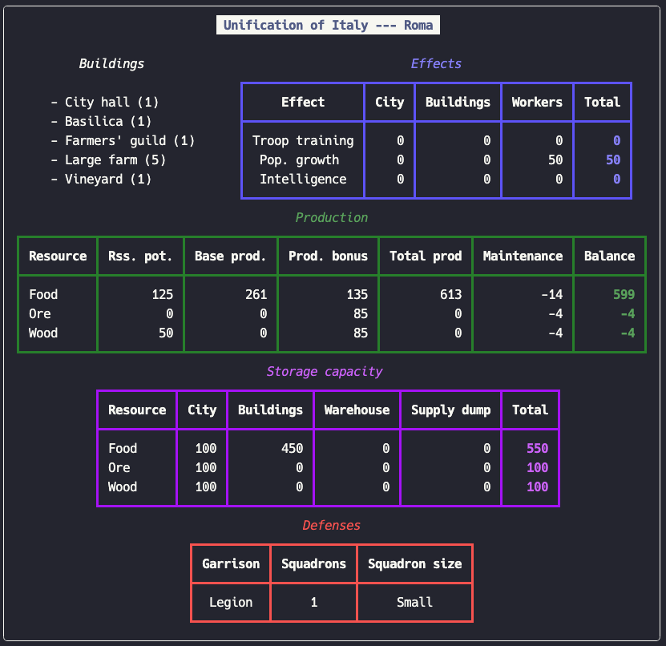
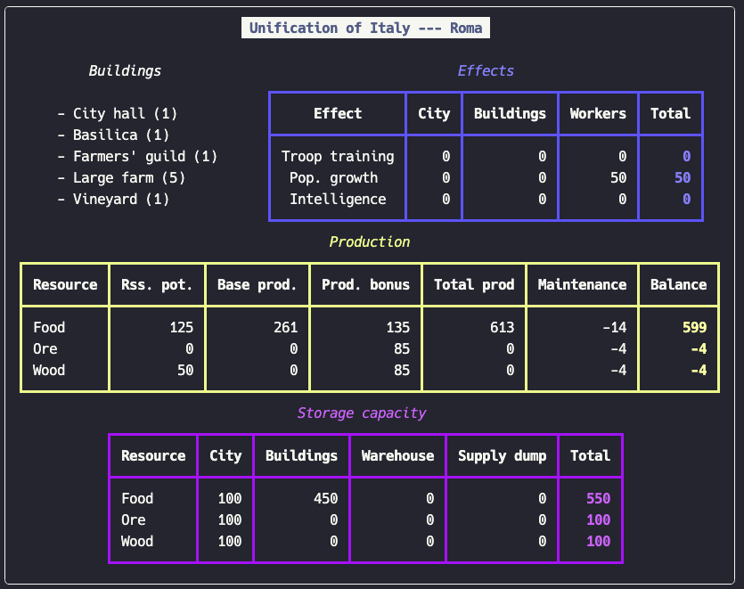
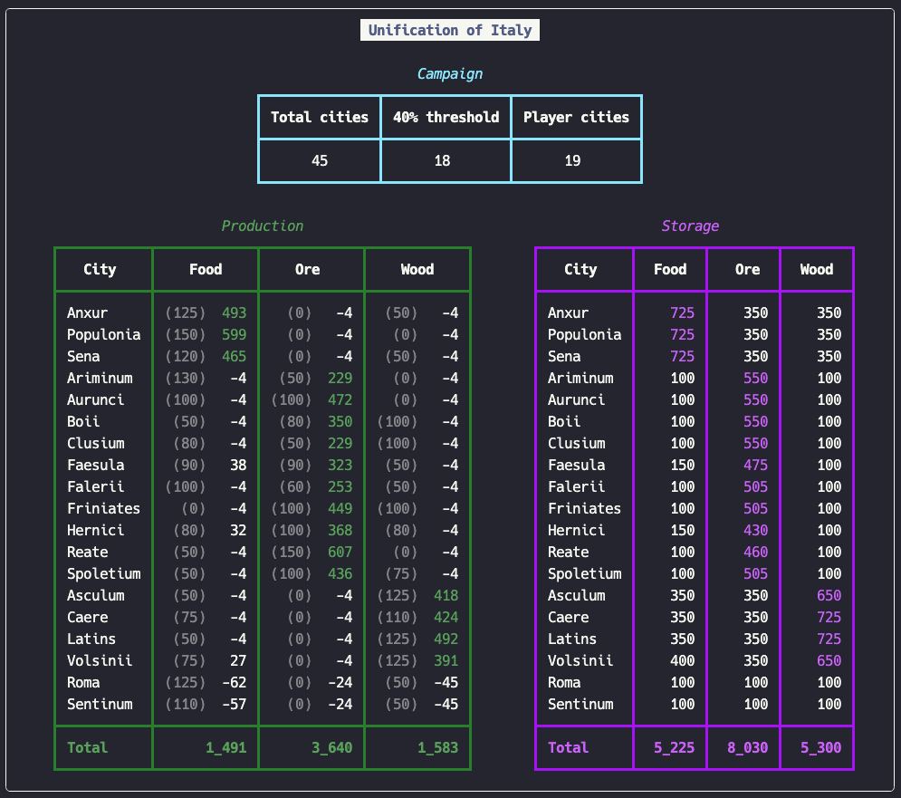

# Legion

This project is a collection of classes that help you organize your kingdom in Legion.

## The `Building` class

The `Building` class is used to represent an instance of a building. Cities can be created from lists of buildings or
dictionaries of building counts.

```python
from modules.building import Building

city_hall: Building = Building(id = "city_hall")
city_hall.display_building()
```


By default, buildings are created with zero assigned workers. Use the `add_workers()`, `remove_workers()`, and
`set_workers()` methods to control the number of workers assigned to a building instance. Assigning more workers than
a building can have, or removing more workers than a building has assigned to it will raise errors.

See more examples in `./building_example.py`.

## The `City` class

The `City` class is the backbone of it all. Given a city (identified by campaign and city name) and the configuration
of buildings that you'd like to build in it, it calculates the information about the city (its effects, production,
storage, and defenses).

The `City` objects can be constructed by passing lists of `Building` objects, or a dictionary of building counts. This
last one is the most offtenly used approach.

```python
from modules.city import City

city: City = City.from_buildings_count(
    campaign = "Unification of Italy",
    name = "Roma",
    buildings = {
        "city_hall": 1,
        "basilica": 1,
        "farmers_guild": 1,
        "large_farm": 5,
        "vineyard": 1,
    },
)

city.display_city()
```



You can pass a `DisplayConfiguration` dictionary to the `display_city()` method to control how the city is displayed.
For example, you could want the Defenses section to be omitted and the Production section to be shown in yellow.

```python
display_configuration: DisplayConfiguration = {
    "production": {
        "color": "yellow",
    },
    "defenses": {
        "include": False,
    },
}

city.display_city(display_configuration)
```



## The `Scenario` class

The `Scenario` class is used to compare two or more possible configurations for a given city, or different cities
altogether. You can create a comparison by passing a list of `City` objects to the `Scenario` class or via a convenient
`Scenario.from_list()` method. Each element of the list must be a dictionary just like with the
`City.from_buildings_count()` method.

```python
from modules.scenario import Scenario

scenario: Scenario = Scenario.from_list(
    data = [
        {
            "campaign": "Unification of Italy",
            "name": "Roma",
            "buildings": {
                "city_hall": 1,
                "basilica": 1,
                "farmers_guild": 1,
                "large_farm": 5,
                "vineyard": 1,
            },
        },
        {
            "campaign": "Unification of Italy",
            "name": "Roma",
            "buildings": {
                "city_hall": 1,
                "basilica": 1,
                "carpenters_guild": 1,
                "large_lumber_mill": 5,
                "warehouse": 1,
            },
        },
    ],
)

scenario.display_scenario_results()
```


You can pass a `DisplayConfiguration` object to control how the cities are displayed. The configuration supplied will
be used for all cities in the `Scenario`.

```python
scenario: Scenario = Scenario.from_list(
    data = [
        ...
    ],
    configuration = {
        "defenses": {
            "include": False,
        },
        "storage": {
            "include": False,
        },
    },
)
```


## The `DisplayConfiguration` class

This helper class is used to help you create valid configurations. The different sections of the output that can be
configured are:

- `city` controls the printing of the campaign and city title
- `buildings` controls the printing of the list of buildings
- `effects` controls the printing of the effects table
- `production` controls the printing of the production table
- `storage` controls the printing of the storage table
- `defenses` controls the printing of the defenses table

For each section you can control:

- `include (bool)`: controls whether the section should be included in the output.
- `height (int)`: controls the space available for that section in the output. It is advisable to let the program handle
  this or you may end up causing the output to be truncated in different ways. The space used will be adjusted based on
  the sections that you decide to include.
- `color (str)`: controls the color in which the section is displayed.

## The `Kingdom` class

The `Kingdom` class produces an overview of the player's situation in a given campaing. It takes as input a list of
cities and a list of sorting order. It displays the total production and storage situation of the kingdom.

You can also use the `Kingdom.from_list()` method to create the Kingdom instance. The list should be a list of city
dictionaries same as with the `Scenario` class.

```python
from modules.kingdom import Kingdom

kingdom: Kingdom = Kingdom.from_list(
    data = [
        {
            "campaign": "Unification of Italy",
            "name": "Hernici",
            "buildings": {
                "city_hall": 1,
                "basilica": 1,
                "miners_guild": 1,
                "outcrop_mine": 1,
                "fishing_village": 1,
                "large_mine": 4,
            },
        },
        {
            "campaign": "Unification of Italy",
            "name": "Reate",
            "buildings": {
                "city_hall": 1,
                "basilica": 1,
                "miners_guild": 1,
                "mountain_mine": 2,
                "large_mine": 4,
            },
        },
        ...
    ],
)

kingdom.display_kingdom_results()
```



This class will raise `ValueError` if:

- not all cities are from the same campaign
- there are duplicated cities
