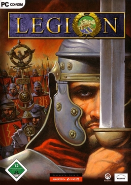
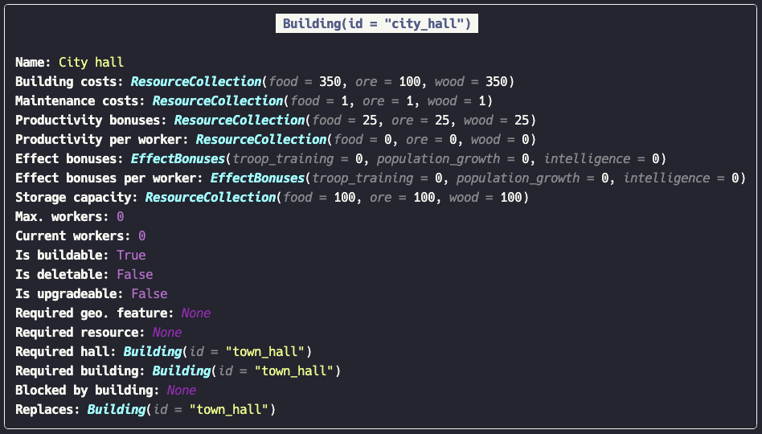
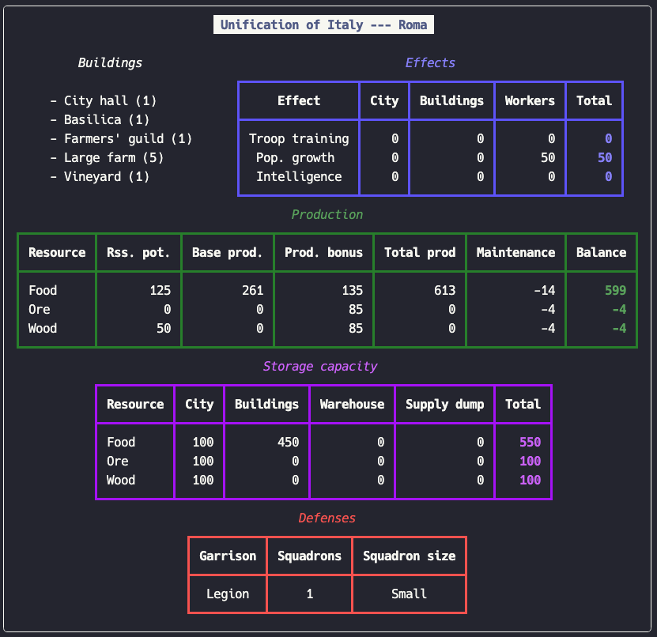
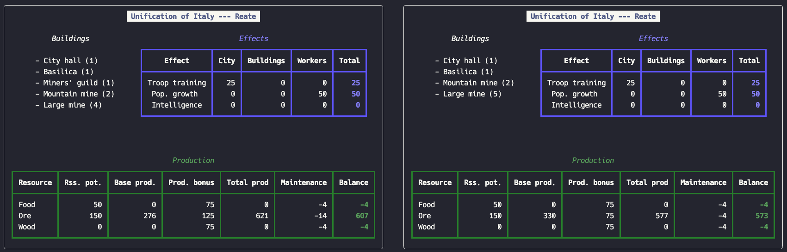
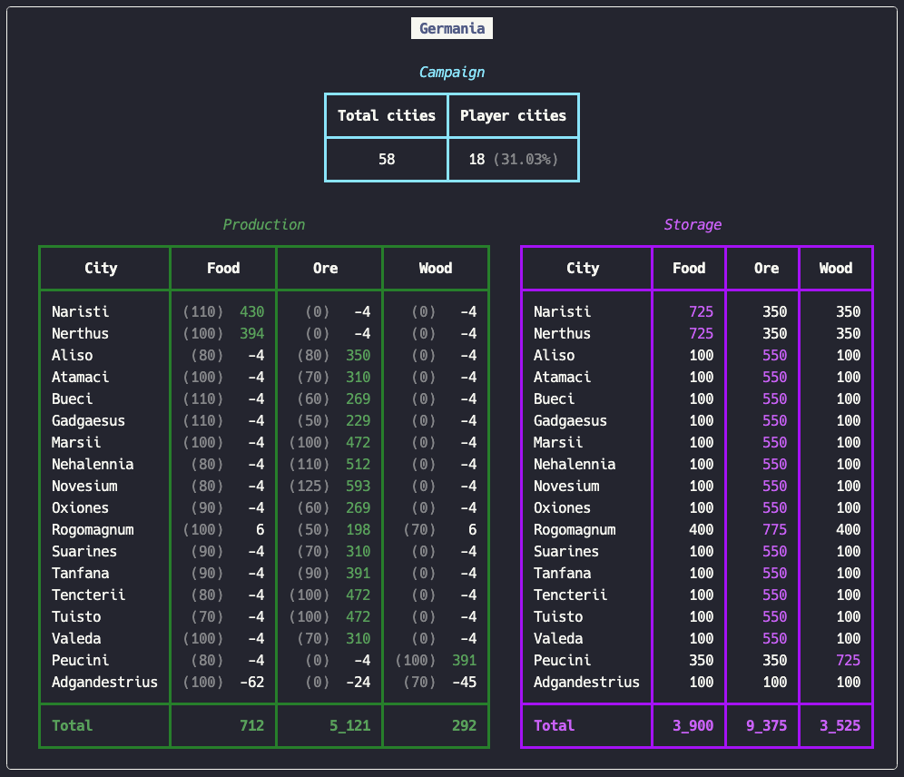

<!-- markdownlint-disable MD041-->
<!-- markdownlint-disable MD033-->
<br>
<h1 align="center">
  <a href="https://www6.slitherine.com/game/legion-gold">
    
  </a>
</h1>
<h4 align="center">A collection of classes that help you organize your kingdom in Legion</h4>
<p align="center">
  <a href="#the-building-class">Buildings</a> •
  <a href="#the-city-class">Cities</a> •
  <a href="#the-scenario-class">Scenarios</a> •
  <a href="#the-displayconfiguration-class">Display configuration</a> •
  <a href="#the-kingdom-class">Kingdom</a>
</p>
<!-- markdownlint-enable MD033-->

## The `Building` class

The `Building` class is used to represent an instance of a building. Cities can be created from lists of buildings or
dictionaries of building counts.

```python
from modules.building import Building

city_hall: Building = Building(id = "city_hall")
city_hall.display_building()
```



By default, buildings are created with zero assigned workers. Use the `add_workers()`, `remove_workers()`, and
`set_workers()` methods to control the number of workers assigned to a building instance. Assigning more workers than
a building can have, or removing more workers than a building has assigned to it will raise errors.

See more examples in `./examples/building.py` (run them with `python -m examples.building`).

### Exceptions

This class will raise the following exceptions:

- `InsufficientNumberOfWorkersError`: if you try to remove more workers than the building currently has.
- `NegativeNumberOfWorkersError`: if you try to add, remove, or set a negative number of workers.
- `TooManyWorkersError`: if you try to add too many workers to a building or set the total number of workers to a value
  greater than the maximum number of workers the build can have.
- `UnknownBuildingError`: if an unknown building ID is passed to the initalizer.

## The `City` class

The `City` class is the backbone of it all. Given a city (identified by campaign and city name), the configuration of
buildings that you'd like to build in it, and a staffing strategy, it calculates the information about the city (its
effects, production, storage, and defenses).

The `City` objects can be constructed by passing lists of `Building` objects, or a dictionary of building counts. This
last one is the most offtenly used approach.

```python
from modules.city import City

city: City = City.from_buildings_count(
    campaign = "Unification of Italy",
    name = "Roma",
    buildings = {
        "city_hall": 1,
        "basilica": 1,
        "farmers_guild": 1,
        "large_farm": 5,
        "vineyard": 1,
    },
)

city.display_city()
```



You can pass a `DisplayConfiguration` dictionary to the `display_city()` method to control how the city is displayed.
For example, you could want the Defenses section to be omitted and the Production section to be shown in yellow.

```python
display_configuration: DisplayConfiguration = {
    "production": {
        "color": "yellow",
    },
    "defenses": {
        "include": False,
    },
}

city.display_city(display_configuration)
```

See more examples in `./examples/city.py` (run them with `python -m examples.city`).

### Staffing strategies

Apart from the decision of which buildings to build, you must also decide how you are going to distribute the workers
in your city. You can chose from four different staffing-strategies:

- `production_first`: will staff the production buildings first.
- `production_only`: will only staff the production buildings. Effects-buildings will not receive workers, even if
  there are more workers available.
- `effects_first`: will staff the effects-buildings first.
- `effects_only`: will only staff the effects buildings. Production buildings will not receive workers, even if there
  are more workers available.

For the purpose of staffing, buildings are classified between *"production"* and *"effects"*. Production buildings are
those for which adding workers increases their resource output (farms, mines, lumber mills, etc). Effects-buildings are
those for which adding workers increases the effect bonuses (troop training, population growth, intelligence).

### Exceptions

This class will raise the following exceptions:

- `NoCityHallError`: if no hall is included in the city buildings.
- `MoreThanOneHallTypeError`: if more than one hall types are passed to the class (e.g. "town_hall", and "city_hall").
- `TooManyHallsError`: if more than one hall (of the same type) is included in the city buildings.
- `FortsCannotHaveBuildingsError`: if you try to add buildings to a Fort (Germania campaign).
- `TooManyBuildingsError`: if you try to include more buildings in a city than allowed.
- `MoreThanOneGuildTypeError`: if you try to add more than one guild building to a city.
- `UnknownBuildingStaffingStrategyError`: if you pass an unknown value to the `staffing_strategy` argument.

The number of buildings that a city can build (both total number and the qty of given buildings) are calculated based
on multiple factors. These includes the hall (fort, village, town, or city), but also the geographical features of the
city (lakes, mountains, etc), the resource potentials, and other limiting-mechanism impossed by the game.

Building-configurations are considered valid if they can happen in the game, not based on whether they follow building
requirement rules. For example, building a Fletcher requires the presence of a Lumber Mill or Large Lumber Mill. But
the final configuration of a city can have a Fletcher and not have any mills. This can happen either because the
Fletcher was there after conquering the city but the mills got destroyed, or because you built the mill, built the
Fletcher, destroyed the mill and built something else in its spot.

## The `Scenario` class

The `Scenario` class is used to compare two or more possible configurations for a given city, or different cities
altogether. You can create a comparison by passing a list of `City` objects to the `Scenario` class or via a convenient
`Scenario.from_list()` method. Each element of the list must be a dictionary just like with the
`City.from_buildings_count()` method.

```python
from modules.scenario import Scenario

scenario: Scenario = Scenario.from_list(
    data = [
        {
            "campaign": "Unification of Italy",
            "name": "Roma",
            "buildings": {
                "city_hall": 1,
                "basilica": 1,
                "farmers_guild": 1,
                "large_farm": 5,
                "vineyard": 1,
            },
        },
        {
            "campaign": "Unification of Italy",
            "name": "Roma",
            "buildings": {
                "city_hall": 1,
                "basilica": 1,
                "carpenters_guild": 1,
                "large_lumber_mill": 5,
                "warehouse": 1,
            },
        },
    ],
)

scenario.display_scenario()
```



You can pass a `DisplayConfiguration` object to control how the cities are displayed. The configuration supplied will
be used for all cities in the `Scenario`.

```python
scenario: Scenario = Scenario.from_list(
    data = [
        ...
    ],
    configuration = {
        "defenses": {
            "include": False,
        },
        "storage": {
            "include": False,
        },
    },
)
```

See more examples in `./examples/scenario.py` (run them with `python -m examples.scenario`).

## The `DisplayConfiguration` class

This helper class is used to help you create valid configurations. The different sections of the output that can be
configured are:

- `city` controls the printing of the campaign and city title
- `buildings` controls the printing of the list of buildings
- `effects` controls the printing of the effects table
- `production` controls the printing of the production table
- `storage` controls the printing of the storage table
- `defenses` controls the printing of the defenses table

For each section you can control:

- `include (bool)`: controls whether the section should be included in the output.
- `height (int)`: controls the space available for that section in the output. It is advisable to let the program handle
  this or you may end up causing the output to be truncated in different ways. The space used will be adjusted based on
  the sections that you decide to include.
- `color (str)`: controls the color in which the section is displayed.

## The `Kingdom` class

The `Kingdom` class produces an overview of the player's situation in a given campaing. It takes as input a list of
cities. It displays the total production and storage situation of the kingdom.

You can also use the `Kingdom.from_list()` method to create the `Kingdom` instance. The list should be a list of city
dictionaries same as with the `Scenario` class.

```python
from modules.kingdom import Kingdom

kingdom: Kingdom = Kingdom.from_list(
    data = [
        {
            "campaign": "Germania",
            "name": "Novesium",
            "buildings": ore_producer,
        },
        {
            "campaign": "Germania",
            "name": "Rogomagnum",
            "buildings": {
                "city_hall": 1,
                "basilica": 1,
                "miners_guild": 1,
                "large_mine": 5,
                "supply_dump": 1,
            },
        },
        {
            "campaign": "Germania",
            "name": "Peucini",
            "buildings": wood_producer,
        },
        ...
    ],
)

kingdom.display_kingdom()
```



You can pass a list to the `sort_order` argument and it will change how the cities are sorted. By default, food
producers will be shown first, followed by ore producers, wood producers, and lastly, cities that don't specialize in
any resource.

The list can be partial. If you just want to specify that "ore" producers should go first

```python
sort_order = ["ore"]
```

is sufficient. The class will sort the cities by ore, followed by food, wood, and no-focus. In short, the list moves
the order that you supplied to the front and keeps the rest in the default sorting order.

See more examples in `./examples/kingdom.py` (run them with `python -m examples.kingdom`).

### Exceptions

This class will raise the following exceptions:

- `CitiesFromMultipleCampaignsError`: not all cities are from the same campaign.
- `DuplicatedCityError`: if there are duplicated cities.
